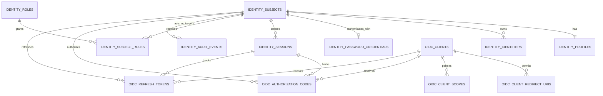

# service-idp-go Data Model Baseline

> Status: Phase 1 baseline approved for migration design. The `oidc_*` model
> remains a future proposal and is not a reason to create OIDC migrations now.

## 1. Model Goals

This model serves a lightweight, locally deployed enterprise IdP. Every
customer deployment has one service instance, one SQLite database, and one
identity namespace. It must provide a stable OIDC `sub`, local password login,
an administration console, auditability, and future first-party OIDC clients
without becoming the owner of product-specific employee, lecturer, medical, or
organisation data.

The model follows five rules:

1. A security subject is not the same thing as a login identifier.
2. A password credential is not part of a person/profile record.
3. Identity-service administration roles are not product roles.
4. User-visible profile data is deliberately minimal; each product owns its
   business profile and permissions.
5. Every persisted primary key is a ULID. Timestamps use SQLite `DATETIME`
   columns with UTC RFC 3339 values and map to `time.Time` in Go. Extensible
   data uses a `metadata` JSON column, following repository conventions.

State, purpose, and category fields use controlled `TEXT` values rather than
Boolean flags. SQLite migrations must apply `CHECK` constraints for every
listed vocabulary; adding a future value is an explicit schema migration, not
an unconstrained application convention.

Every `metadata` column uses `TEXT NOT NULL DEFAULT '{}'` with
`CHECK(json_valid(metadata))` and `CHECK(json_type(metadata) = 'object')`.
It is a bounded extension point for non-sensitive, low-frequency information,
not a substitute for a field requiring uniqueness, a foreign key, filtering,
or authorization.

All domain foreign keys use `ON DELETE RESTRICT`; identity records are not
hard-deleted. Bounded maintenance deletes ephemeral dependent records in
dependency order. Text length rules are implemented with `CHECK(length(...))`,
not with SQLite `VARCHAR(n)` declarations.

## 2. Core Vocabulary

| Term | Meaning | Not Used For |
| --- | --- | --- |
| Subject | Stable security principal; its ULID is the future OIDC `sub`. | A login string, email address, employee record, or product user profile. |
| Identifier | A value by which a subject may be found or authenticated, such as an account identifier or verified email. | The durable cross-product reference. |
| Profile | Minimal, presentation-oriented information shared by all products. | Department, licence, job title, class, institution, or product role. |
| Credential | Proof used to authenticate the subject. Phase 1 supports only a password credential. | A browser session or OIDC token. |
| Control-plane role | A permission inside `identityd`, such as identity administrator. | A Trainova or Aceso authorisation role. |
| Session | A revocable browser login state represented to the browser by an opaque cookie. | An OIDC access token or refresh token. |

The UI uses the terms `账号标识` and `显示名称`. It does not call a database
column `login_name` and it does not make email the identity primary key.

## 3. Entity Relationship Overview



`identity_subjects` through `identity_audit_events` belong to Phase 1.
`oidc_*` tables begin in Phase 2 or Phase 3 and must not be created merely to
anticipate future work.

## 4. Phase 1 Identity Model

### 4.1 `identity_subjects`

This is the durable security-principal table. Its `id` is immutable and is the
only identity value that products persist as `identity_subject_id`.

| Field | SQLite type | Rules | Purpose |
| --- | --- | --- | --- |
| `id` | `TEXT` | ULID primary key; immutable | Future OIDC `sub`. |
| `status` | `TEXT` | `启用` or `禁用`; indexed | Authentication and session eligibility. |
| `security_version` | `INTEGER` | Positive; starts at `1` | Increment on disablement, password recovery, or other global security reset; copied to each new session. |
| `disabled_at` | `DATETIME` nullable | UTC timestamp | Records disablement without deleting the subject. |
| `metadata` | `TEXT` | JSON object; defaults to `{}` | Low-frequency local extensions only, never credential or product data. |
| `created_at` | `DATETIME` | UTC timestamp | Audit and lifecycle. |
| `updated_at` | `DATETIME` | UTC timestamp | Audit and lifecycle. |

`status` is intentionally limited to `启用` and `禁用`. A future invitation
workflow should use invitation records rather than adding ambiguous states such
as `待激活` to the security subject. The migration must enforce both
`CHECK(status IN ('启用', '禁用'))` and the state/timestamp pairing below:

```text
status = '启用'  -> disabled_at IS NULL
status = '禁用'  -> disabled_at IS NOT NULL
```

Re-enabling a subject sets `status=启用` and clears `disabled_at`; earlier
disablement history remains in `identity_audit_events`.

### 4.2 `identity_profiles`

This is a one-to-one, minimal profile for presentation across the control
plane and OIDC standard claims.

| Field | SQLite type | Rules | Purpose |
| --- | --- | --- | --- |
| `subject_id` | `TEXT` | ULID primary key and foreign key to subject | Profile owner. |
| `display_name` | `TEXT` | Required; 1-120 Unicode characters | Safe human-facing name for UI and future `name` claim. |
| `created_at` | `DATETIME` | UTC timestamp | Audit and lifecycle. |
| `updated_at` | `DATETIME` | UTC timestamp | Profile lifecycle. |

The identity service does not store department, employee number, medical
licence, class, job title, organisation membership, or legal-name components.
Those are product or customer-domain data. A customer may make an employee
number an identifier, but it is not a universal profile field.
The migration enforces `CHECK(length(display_name) BETWEEN 1 AND 120)`.

### 4.3 `identity_identifiers`

This table removes the need for a `login_name` column and supports a stable,
professional identifier model. A login form submits a single field named
`identifier`; the service resolves it against enabled identifiers whose usage
permits login.

| Field | SQLite type | Rules | Purpose |
| --- | --- | --- | --- |
| `id` | `TEXT` | ULID primary key | Identifier record. |
| `subject_id` | `TEXT` | Required foreign key; indexed | Identifier owner. |
| `identifier_type` | `TEXT` | `账号` / `邮箱` / `手机号` / `工号` | Determines validation and normalisation rules. |
| `identifier_value` | `TEXT` | Required; validated user-facing form | Display and controlled edits. |
| `normalized_value` | `TEXT` | Required; never shown | Lookup and uniqueness. |
| `identifier_usage` | `TEXT` | `主登录` / `辅助登录` / `联系` | Encodes whether the identifier is the default login identity, an additional login identity, or contact-only. |
| `status` | `TEXT` | `启用` / `禁用` | Allows one identifier to stop authenticating without disabling the whole subject. |
| `verified_at` | `DATETIME` nullable | UTC timestamp | Required for verified email or phone claims in later OIDC work. |
| `created_at` | `DATETIME` | UTC timestamp | Audit and lifecycle. |
| `updated_at` | `DATETIME` | UTC timestamp | Audit and lifecycle. |

Required database constraints and indexes:

```text
UNIQUE(identifier_type, normalized_value)
UNIQUE(subject_id) WHERE identifier_usage = '主登录'
INDEX(subject_id)
INDEX(normalized_value)
  WHERE status = '启用'
    AND identifier_usage IN ('主登录', '辅助登录')
CHECK(identifier_type IN ('账号', '邮箱', '手机号', '工号'))
CHECK(identifier_usage IN ('主登录', '辅助登录', '联系'))
CHECK(status IN ('启用', '禁用'))
CHECK(length(identifier_value) BETWEEN 1 AND 320)
```

The service must reject an identity creation transaction without one enabled
`主登录` identifier. An enabled subject must continue to have exactly one
enabled `主登录` identifier after every identifier create, edit, status, or usage
change. SQLite can enforce at most one primary row with the partial unique
index, but the service transaction must enforce the cross-table active-subject
invariant. A primary identifier change updates the existing `主登录` row in
Phase 1; identifier history is represented by audit events, not an additional
primary row.

An identifier in `联系` usage never authenticates; an identifier in `辅助登录`
usage can authenticate but is not the default account identifier shown in the
control plane. `identifier_value` is saved after validation and presentation
normalisation, never as an untrimmed raw login submission. Identifier
normalisation is type-specific:

| Type | Input policy | Normalised lookup value |
| --- | --- | --- |
| `账号` | 3-64 Unicode letters, digits, `_`, `-`, `.` after trim | Unicode NFKC + case fold. |
| `邮箱` | Valid mailbox syntax, stripped of surrounding whitespace | Unicode NFC + lower-case. |
| `手机号` | Valid E.164 number | E.164 digits with leading `+`. |
| `工号` | Customer-defined allowed format | Trimmed, Unicode NFKC, upper-case. |

Phase 1 creates exactly one enabled `账号` identifier with usage `主登录`. Email,
phone, and employee number remain supported model types but are not exposed
until their verification and privacy requirements are agreed. This keeps the
first login workflow predictable while avoiding a permanent `login_name`
column.

### 4.4 `identity_password_credentials`

One local password credential record is allowed per subject in Phase 1.

| Field | SQLite type | Rules | Purpose |
| --- | --- | --- | --- |
| `id` | `TEXT` | ULID primary key | Credential record. |
| `subject_id` | `TEXT` | Required foreign key; unique | Credential owner. |
| `password_hash` | `TEXT` | Required Argon2id PHC string | Stores algorithm, salt, and parameters without separate plaintext fields. |
| `password_revision` | `INTEGER` | Positive; starts at `1`; increments for every password-hash change | Optimistic locking and credential-change audit correlation. |
| `credential_status` | `TEXT` | `有效` / `需更新` / `已作废`; defaults to `有效` and `CHECK` constrained | Password lifecycle and temporary-password handling. |
| `changed_at` | `DATETIME` | UTC timestamp | Credential lifecycle. |
| `created_at` | `DATETIME` | UTC timestamp | Audit. |
| `updated_at` | `DATETIME` | UTC timestamp | Audit. |

`有效` permits normal login. `需更新` is used for an administrator-issued
temporary password: authentication may create only a restricted session that
can change the password or sign out. `已作废` never permits password
authentication and preserves the credential record until an audited recovery
replaces it. No password history, reset token, recovery email, or MFA factor
exists in Phase 1. The bootstrap/recovery flow is an audited local operator
command, not a public password-recovery endpoint.

The migration enforces `UNIQUE(subject_id)`, `CHECK(password_revision >= 1)`,
and `CHECK(credential_status IN ('有效', '需更新', '已作废'))`. A password update
uses `WHERE password_revision = :expected_revision`, increments the revision,
and increments the subject `security_version` in the same transaction. This
avoids a lost credential update and gives the session layer a global security
reset signal.

### 4.5 `identity_roles` And `identity_subject_roles`

The control plane uses roles rather than an `is_admin` flag. These roles do
not cross the product boundary and are never emitted as Trainova or Aceso
business roles.

Seeded Phase 1 roles:

| Role code | Display name | Capability |
| --- | --- | --- |
| `identity.admin` | `身份管理员` | Manage subjects, credentials, roles, sessions, clients, and recovery actions. |
| `identity.audit.read` | `审计查看者` | Read dashboard and immutable audit events only. |

`identity_roles` is a small reference table:

| Field | SQLite type | Rules | Purpose |
| --- | --- | --- | --- |
| `id` | `TEXT` | ULID primary key | Stable role reference. |
| `role_code` | `TEXT` | Required; immutable; unique | Machine-readable capability name. |
| `display_name` | `TEXT` | Required | Chinese administration-UI label. |
| `description` | `TEXT` | Required | Human-readable capability explanation. |
| `created_at` / `updated_at` | `DATETIME` | UTC timestamps | Lifecycle. |

`identity_subject_roles` records immutable role grants:

| Field | SQLite type | Rules | Purpose |
| --- | --- | --- | --- |
| `id` | `TEXT` | ULID primary key | Grant record. |
| `subject_id` | `TEXT` | Required foreign key; indexed | Role recipient. |
| `role_id` | `TEXT` | Required foreign key; indexed | Granted control-plane role. |
| `granted_by_subject_id` | `TEXT` nullable foreign key | Administrator who granted the role; `NULL` for bootstrap or local recovery. |
| `created_at` | `DATETIME` | UTC timestamp | Grant time. |

The migration enforces `UNIQUE(subject_id, role_id)`. Every `NULL`
`granted_by_subject_id` grant requires an accompanying bootstrap or recovery
audit event that records the non-subject actor source in `metadata`.

The removal or disablement of an `identity.admin` holder must occur in a single
SQLite write transaction that verifies another enabled `identity.admin` holder
remains. This enforces the last-administrator protection requirement.

### 4.6 `identity_sessions`

Browser sessions are opaque and independently revocable.

| Field | SQLite type | Rules | Purpose |
| --- | --- | --- | --- |
| `id` | `TEXT` | ULID primary key | Session record. |
| `subject_id` | `TEXT` | Required foreign key; indexed | Authenticated subject. |
| `subject_security_version` | `INTEGER` | Required positive value copied from subject at authentication | Rejects a session after a global subject security reset. |
| `token_hash` | `BLOB` | SHA-256 of 32 random bytes; unique | Verifies session cookie without persisting its value. |
| `csrf_token_hash` | `BLOB` | SHA-256 of random CSRF value | Validates state-changing browser requests. |
| `session_access` | `TEXT` | `完整` / `仅改密`; `CHECK` constrained | Restricts a temporary-password session without relying on current credential state. |
| `authenticated_at` | `DATETIME` | UTC timestamp | Authentication time. |
| `last_seen_at` | `DATETIME` | UTC timestamp | Idle-expiry calculation. |
| `expires_at` | `DATETIME` | UTC timestamp | Absolute expiry. |
| `idle_expires_at` | `DATETIME` | UTC timestamp | Inactivity expiry. |
| `revoked_at` | `DATETIME` nullable | UTC timestamp | Explicit invalidation. |
| `revoked_reason` | `TEXT` nullable | `用户退出` / `主体禁用` / `凭据变更` / `权限收回` / `管理员撤销` | Audit correlation. |
| `metadata` | `TEXT` | JSON object; defaults to `{}` | Non-secret request metadata. |
| `created_at` | `DATETIME` | UTC timestamp | Audit. |

The browser receives only a cookie containing the random session token. The
service sets `HttpOnly`, `SameSite=Lax`, `Path=/crate-api/identity/v1`, and
`Secure` in production. A current-session lookup joins the subject and accepts
the session only when the subject is `启用`,
`session.subject_security_version = subject.security_version`, the session is
not revoked, and both expiry timestamps remain in the future. The migration
enforces `CHECK(subject_security_version >= 1)`,
`CHECK(session_access IN ('完整', '仅改密'))`, and a nullable
`revoked_reason` vocabulary matching the table. A `仅改密` session can access
only password-change and sign-out routes, even if another request changes the
credential status before the session ends.

Disabling a subject, recovering its password, or removing its administration
role increments `security_version` where applicable and revokes all of that
subject's active sessions. New authorization checks always load current role
grants rather than caching roles in the session.

### 4.7 `identity_login_throttles`

Login throttling needs persistent, low-volume state because the process can
restart. The table stores only keyed hashes, never a raw identifier or IP.

| Field | SQLite type | Rules | Purpose |
| --- | --- | --- | --- |
| `id` | `TEXT` | ULID primary key | Throttle record. |
| `identifier_hash` | `BLOB` | HMAC-SHA-256 with deployment secret | Groups attempts by attempted identifier. |
| `source_hash` | `BLOB` | HMAC-SHA-256 with deployment secret | Groups attempts by validated client address. |
| `failed_count` | `INTEGER` | Non-negative | Fixed-window attempt count. |
| `window_started_at` | `DATETIME` | UTC timestamp | Window start. |
| `locked_until` | `DATETIME` nullable | UTC timestamp | Temporary lockout. |
| `updated_at` | `DATETIME` | UTC timestamp | Cleanup and audit. |

`UNIQUE(identifier_hash, source_hash)` ensures one active throttle record per
identifier/address pair. Expired rows are deleted by a bounded maintenance job.
The deployment secret used for the HMAC is stored outside SQLite.

### 4.8 `identity_audit_events`

Audit events are append-only. They provide accountability without storing
credentials, session values, authorization codes, refresh tokens, or raw IP
addresses.

| Field | SQLite type | Rules | Purpose |
| --- | --- | --- | --- |
| `id` | `TEXT` | ULID primary key | Event record. |
| `event_action` | `TEXT` | `登录` / `退出登录` / `主体创建` / `主体状态变更` / `标识符变更` / `凭据变更` / `角色授予` / `角色撤销` / `会话撤销` / `管理员恢复` / `维护清理` | Attempted action, independent from result. |
| `outcome` | `TEXT` | `成功` / `失败` | Filterable result. |
| `actor_subject_id` | `TEXT` nullable | Foreign key when known | Who initiated the event. |
| `target_subject_id` | `TEXT` nullable | Foreign key when relevant | Which subject was affected. |
| `request_id` | `TEXT` nullable | Correlation ID | Joins application logs without exposing a secret. |
| `source_hash` | `BLOB` nullable | HMAC-SHA-256 | Pseudonymous network correlation. |
| `metadata` | `TEXT` | JSON object; defaults to `{}` | Non-secret event context. |
| `created_at` | `DATETIME` | UTC timestamp; indexed | Event order and retention. |

`event_action` describes the attempted action; `outcome` describes its result
and must not be duplicated inside the action name. The Phase 1 migration uses
the listed `event_action` vocabulary and
`CHECK(outcome IN ('成功', '失败'))`. Bootstrap is recorded as `主体创建` with
bootstrap actor-source metadata.

Phase 1 defaults to 180-day audit retention, configured by
`IDENTITYD_AUDIT_RETENTION_DAYS`. Cleanup runs in bounded batches and emits one
maintenance audit event per completed deletion run.

## 5. OIDC Persistence Model

These entities are added only after the Phase 1 control plane and the client
data-model review pass. The first protocol release supports only first-party
public SPAs using Authorization Code + PKCE S256. It does not store a client
secret and it does not support machine-to-machine credentials.

### 5.1 `oidc_clients`

| Field | SQLite type | Rules | Purpose |
| --- | --- | --- | --- |
| `id` | `TEXT` | ULID primary key | Internal record reference. |
| `client_id` | `TEXT` | Immutable, unique, system-generated public identifier | OIDC client identifier. |
| `display_name` | `TEXT` | Required | Administration UI label. |
| `client_type` | `TEXT` | Phase 3 value is only `公开` | Makes the supported security model explicit. |
| `status` | `TEXT` | `启用` / `禁用` | Stops new authorization and refresh activity. |
| `created_by_subject_id` | `TEXT` | Required foreign key | Administrative accountability. |
| `metadata` | `TEXT` | JSON object; defaults to `{}` | Non-secret client extensions. |
| `created_at` | `DATETIME` | UTC timestamp | Lifecycle. |
| `updated_at` | `DATETIME` | UTC timestamp | Lifecycle. |

`client_id` should be generated as `idp_` plus a ULID rather than accepting a
human-provided value. Human-readable labels remain in `display_name`.
`client_id` is the public OIDC protocol value. Every database relationship uses
the unambiguous `oidc_client_id` name and references the internal ULID primary
key `oidc_clients.id`; handlers resolve the public value before persistence
operations.

### 5.2 `oidc_client_redirect_uris` And `oidc_client_scopes`

Redirect URIs and scopes are normalized into separate tables rather than JSON
arrays, allowing exact uniqueness, audits, and indexed validation.

| Table | Required fields | Constraints |
| --- | --- | --- |
| `oidc_client_redirect_uris` | `id`, `oidc_client_id`, `redirect_uri`, `created_at` | `oidc_client_id` is a foreign key to `oidc_clients.id`; unique `(oidc_client_id, redirect_uri)`; absolute HTTPS URI in production; localhost only in explicit development mode. |
| `oidc_client_scopes` | `id`, `oidc_client_id`, `scope`, `created_at` | `oidc_client_id` is a foreign key to `oidc_clients.id`; unique `(oidc_client_id, scope)`; the first release allows only `openid` and `profile`. |

The authorisation request must match the registered redirect URI byte-for-byte
after the service's one-time URI validation. It must not perform prefix,
wildcard, or query-parameter matching.

### 5.3 `oidc_authorization_codes`

| Field | SQLite type | Rules |
| --- | --- | --- |
| `id` | `TEXT` | ULID primary key. |
| `code_hash` | `BLOB` | SHA-256 of a 32-byte random code; unique. |
| `subject_id` / `oidc_client_id` / `session_id` | `TEXT` | Required foreign keys; `oidc_client_id` references `oidc_clients.id`. |
| `redirect_uri` | `TEXT` | Exact URI approved in the authorization request. |
| `code_challenge` | `TEXT` | Required PKCE S256 challenge. |
| `nonce` | `TEXT` nullable | Returned in ID token when supplied. |
| `scope` | `TEXT` | Canonically sorted, space-delimited scopes. |
| `expires_at` | `DATETIME` | Five-minute maximum lifetime. |
| `consumed_at` | `DATETIME` nullable | One-time-use marker, set atomically. |
| `created_at` | `DATETIME` | UTC timestamp. |

The exchange query is an atomic compare-and-set: it succeeds only when the
hash matches, `consumed_at` is null, the code has not expired, and client,
redirect URI, and PKCE verifier validation all pass.

### 5.4 `oidc_refresh_tokens`

| Field | SQLite type | Rules |
| --- | --- | --- |
| `id` | `TEXT` | ULID primary key. |
| `token_hash` | `BLOB` | SHA-256 of random opaque token; unique. |
| `family_id` | `TEXT` | ULID shared by every rotation descendant. |
| `parent_token_id` | `TEXT` nullable | Foreign key to the previous rotation record. |
| `subject_id` / `oidc_client_id` / `session_id` | `TEXT` | Required foreign keys; `oidc_client_id` references `oidc_clients.id`. |
| `scope` | `TEXT` | Canonically sorted, space-delimited scopes. |
| `expires_at` | `DATETIME` | UTC timestamp. |
| `used_at` / `revoked_at` | `DATETIME` nullable | Rotation and revocation state. |
| `reused_at` | `DATETIME` nullable | Detects replay; revokes entire family. |
| `created_at` | `DATETIME` | UTC timestamp. |

Each refresh exchange atomically marks the old token as used, issues one child
in the same `family_id`, and treats later use of the old token as family
replay. Disabling a subject, disabling a client, recovery, or logout revokes
all related refresh-token families.

### 5.5 `oidc_signing_keys`

The database contains only public metadata. Private key material is a protected
file or OS secret reference outside SQLite.

| Field | SQLite type | Rules |
| --- | --- | --- |
| `id` | `TEXT` | ULID primary key. |
| `kid` | `TEXT` | Unique public key identifier. |
| `algorithm` | `TEXT` | First supported value selected during OIDC protocol review. |
| `public_jwk` | `TEXT` | JSON object returned from JWKS while valid. |
| `private_key_reference` | `TEXT` | Name/path understood by deployment configuration; never a PEM value. |
| `status` | `TEXT` | `激活` / `已轮换` / `已吊销`. |
| `not_before` / `expires_at` | `DATETIME` | Key validity window. |
| `created_at` | `DATETIME` | UTC timestamp. |
| `updated_at` | `DATETIME` | UTC timestamp for status or validity-window changes. |

The first algorithm is intentionally not fixed by this data model. The OIDC
protocol review must select one algorithm that is supported by the chosen Go
library and the initial resource-server clients before key-generation code is
written.

## 6. State Transitions And Transaction Invariants

| Operation | Required transaction and invariant |
| --- | --- |
| Create subject | Create subject, profile, first enabled `主登录` identifier, credential, and audit event in one transaction. Add a control-plane role only for bootstrap or an explicit administrator action. |
| Disable subject | Set `status=禁用`, increment `security_version`, revoke active sessions and refresh tokens, then write audit event in one transaction. |
| Recover administrator | Change credential, increment `security_version`, revoke sessions and refresh tokens, then write `管理员恢复` audit event in one transaction. |
| Remove admin role | Verify another enabled `identity.admin` holder exists, delete the assignment, increment the affected subject `security_version`, revoke its sessions, and write an audit event in one transaction. |
| Disable admin subject | Verify another enabled `identity.admin` holder exists before changing subject status. |
| Create session | Require an enabled subject, a password credential in `有效` or `需更新`, and no active throttle lock; copy the current `security_version`, set `session_access` to `完整` or `仅改密`, create session, and audit success in one transaction. |
| Failed login | Update throttle record and write audit failure without revealing whether the identifier exists. |
| Consume authorization code | Atomically mark code consumed only after client, redirect URI, expiry, and PKCE checks pass. |
| Rotate refresh token | Atomically consume parent, create child, and revoke family on replay. |

SQLite's single-writer model makes these compact transactions appropriate for
the expected internal login volume. `sqlc` provides individual queries; a Go
service method owns each cross-table transaction and its invariant.

## 7. `sqlc` Query Surface

The initial query files are organised by entity, not by HTTP page:

```text
db/queries/
├── subjects.sql
├── identifiers.sql
├── credentials.sql
├── roles.sql
├── sessions.sql
├── throttles.sql
├── audit_events.sql
├── subject_management.sql
├── role_management.sql
├── session_revocation.sql
├── oidc_clients.sql              # Phase 2
├── oidc_authorization_codes.sql  # Phase 3
├── oidc_refresh_tokens.sql       # Phase 3
└── oidc_signing_keys.sql         # Phase 3
```

Phase 1 queries must include at least:

| Query | Behaviour |
| --- | --- |
| `GetSubjectByIdentifier` | Resolves an enabled `主登录` or `辅助登录` identifier by normalized value. |
| `ListSubjects` | Pagination, filtered status, and identifier/display-name search. |
| `CreateSubject` / `CreateProfile` / `CreateIdentifier` | Used inside the subject-creation transaction. |
| `GetPasswordCredentialBySubjectID` | Retrieves only the PHC hash needed for verification. |
| `UpdatePasswordCredential` | Changes password, revision, credential status, and subject security version with an expected credential revision; never exposes the hash in a list query. |
| `AssignRole` / `RemoveRole` | Maintains control-plane role membership. |
| `CountEnabledSubjectsByRoleCode` | Enforces last-administrator protection. |
| `CreateSession` / `GetActiveSessionByTokenHash` / `RevokeSessionsBySubjectID` | Browser-session lifecycle, including security-version and session-access checks. |
| `UpsertLoginThrottle` / `GetLoginThrottle` / `DeleteExpiredLoginThrottles` | Persistent bounded login throttling. |
| `InsertAuditEvent` / `ListAuditEvents` / `DeleteExpiredAuditEvents` | Append-only audit lifecycle. |

`sqlc` models are internal persistence types. HTTP handlers receive dedicated
view models and must never serialize password hashes, token hashes, CSRF
hashes, or private key references.

## 8. Input And API Contract

The login form and future session API use this vocabulary:

```text
identifier=<account identifier>
password=<password>
```

They do not use `username`, `login_name`, or email as a mandatory field.
Error responses remain deliberately generic: an invalid identifier, an invalid
password, disabled account, and active throttle lock all return the same login
failure response to unauthenticated callers.

The user-management UI displays a primary identifier, display name, account
state, control-plane roles, and security activity. It does not display password
credential data or raw session/token values.

## 9. Migration Order

```text
000001_identity_subjects.sql
000002_identity_profiles.sql
000003_identity_identifiers.sql
000004_identity_password_credentials.sql
000005_identity_roles.sql
000006_identity_subject_roles.sql
000007_identity_sessions.sql
000008_identity_login_throttles.sql
000009_identity_audit_events.sql

000100_oidc_clients.sql
000101_oidc_client_redirect_uris.sql
000102_oidc_client_scopes.sql
000200_oidc_authorization_codes.sql
000201_oidc_refresh_tokens.sql
000202_oidc_signing_keys.sql
```

The Phase 1 schema is intentionally complete before OIDC tables are added.
Migrations never modify a product database. SQLite migrations run at service
startup and are recorded in `schema_migrations`.

## 10. Operational Retention Defaults

| Data | Default retention | Cleanup behaviour |
| --- | --- | --- |
| Revoked/expired browser sessions | 30 days | Bounded periodic deletion. |
| Login throttle records | 7 days after expiry | Bounded periodic deletion. |
| Authorization codes | 24 hours after expiry/consumption | Bounded periodic deletion. |
| Revoked/expired refresh tokens | 30 days | Bounded periodic deletion. |
| Audit events | 180 days | Configurable bounded periodic deletion. |
| Subjects, identifiers, profiles, credentials, roles | No automatic deletion | Disable or change only; preserves referential integrity. |

All retention periods are configuration defaults, not hard-coded policy. A
customer with compliance requirements can extend audit retention before first
deployment.

## 11. Model Decisions Already Made

- No `login_name`, `username`, or email primary-key field exists on the subject
  table.
- The stable cross-product key is `identity_subjects.id`, never an identifier.
- The first and only Phase 1 identifier is an enabled `账号` with usage
  `主登录`. Later supported identifiers may be `辅助登录` or `联系` without adding
  Boolean flag columns.
- Every enabled subject has exactly one enabled `主登录` identifier; its changes
  use a service transaction and are audited.
- Password hashes live in a credential table, not a subject table.
- `password_revision` protects credential updates from lost writes;
  `security_version` invalidates existing sessions after a global reset.
- Identity-control permissions use role assignments, not an `is_admin` flag.
- The shared profile contains only `display_name`. Product-specific identity
  attributes and user preferences stay outside this service.
- The Phase 1 roles are `identity.admin` and `identity.audit.read`; no general
  user role is assigned when a subject is created.
- Phase 1 audit retention defaults to 180 days and remains configurable.
- Browser session tokens, CSRF values, authorization codes, refresh tokens,
  IP values, and login identifiers used for throttling are never stored raw.
- OIDC database foreign keys use internal `oidc_client_id` ULIDs; the public
  protocol `client_id` is resolved only at the service boundary.
- The first OIDC release supports first-party public SPAs with PKCE and only
  `openid profile` scopes. Verified-email support is a later addition.
- Generated Go query code is committed with its migrations and query source;
  frontend build output is not committed.

## 12. Deferred Phase 2/3 Decisions

1. A server-rendered confidential client remains outside the first OIDC
   release. Add it only after a relying-party integration requires it and its
   client-secret handling can be reviewed separately.
2. The signing-key algorithm is selected after a compatibility proof with the
   chosen Go protocol library and the first relying party; it is not fixed in
   a Phase 1 migration.
3. Email identifiers, ownership verification, and the OIDC `email` scope are
   designed together when a product has a concrete requirement. They are not
   introduced as an unverified contact field in Phase 1.

## 13. Recommendation

Use this Phase 1 subject/identifier/credential model as the input to SQLite
migration and `sqlc` query design. It is complete enough to implement the
local identity-control plane without reopening the service boundary, SQLite,
or the one-customer, one-database deployment model. Keep all OIDC migrations
deferred until the listed Phase 2/3 decisions have a concrete relying party.
