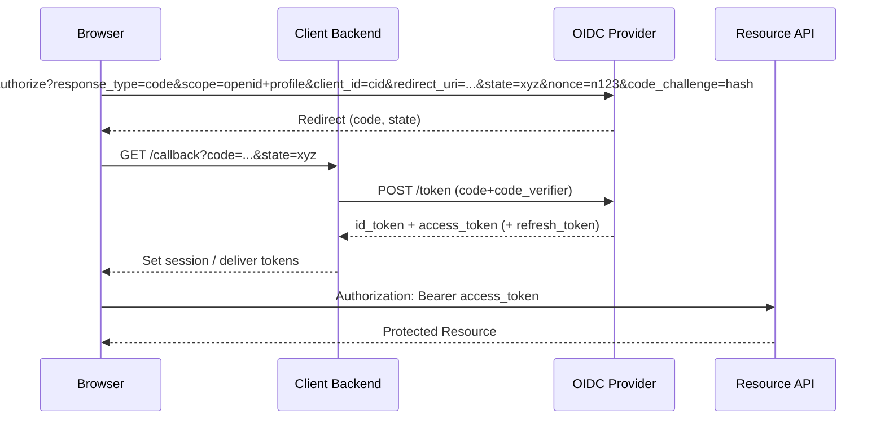

# OpenID Connect (OIDC) 技术实现与集成文档

> 说明：本文件取代原 `sso.md`。OIDC 被作为本平台统一身份认证与（可扩展）授权的核心协议，后续所有单点登录能力与 OAuth 扩展均以本设计为基础。

## 1. 背景与目标
在多前端（Portal、运营后台、客服、BI、移动 App / H5）、多角色（C 端用户、商家、内部员工、管理员、合作伙伴）场景下，需要：
- 统一身份认证（Who）+ 受控授权（What）
- 支持跨应用单点登录（SSO 体验）
- 标准化 Token（便于微服务、第三方集成）
- 安全（MFA、Token 旋转、吊销、权限版本化）
- 可扩展（未来接入企业微信 / 钉钉 / 外部 OIDC / SAML）

OIDC 选择原因：
1. 建立在成熟的 OAuth 2.0 之上；
2. 提供“身份层”（ID Token + UserInfo + Discovery）；
3. 具备生态互操作性（可与标准 IdP/网关对接）；
4. 简化多客户端 / 多前端统一登录实现；
5. 有利于后续细分：纯 OAuth 授权、M2M、Federation。

## 2. 名词与角色
| 名称 | 说明 | 代码中可能出现的别名 |
|------|------|------------------|
| End-User | 最终用户 | user |
| Relying Party (RP) | 依赖 OIDC 的客户端（Web/SPAs/Native） | client/app |
| Authorization Server / OpenID Provider (OP) | 身份提供者 | IdP / auth service |
| Resource Server | API 资源服务 | api service |
| ID Token | 身份令牌（JWT） | id_token |
| Access Token | 访问 API 的令牌 | access_token |
| Refresh Token | 刷新 access_token | refresh_token |
| Discovery | Well-known 配置 | /.well-known/openid-configuration |
| JWKS | 公钥集合 | /.well-known/jwks.json |

## 3. 端点规范
| Endpoint | Method | 描述 | 认证/安全 |
|----------|--------|------|-----------|
| /.well-known/openid-configuration | GET | Discovery 文档 | 公共 |
| /.well-known/jwks.json | GET | 公钥集合 (JWKS) | 公共缓存 |
| /authorize | GET | 授权（Authorization Code + PKCE） | 浏览器交互，含 state/nonce |
| /token | POST | 交换 code / 刷新 / 客户端凭证 | 基于 client auth (basic/private_key_jwt) |
| /userinfo | GET | 获取用户标准 Claims | Bearer Access Token |
| /logout | POST/GET | RP 发起登出 | 需要 id_token_hint / session 标识 |
| /introspect (可选) | POST | Access/Refresh Token 状态查询 | 仅受信资源服务 |
| /revoke (可选) | POST | 撤销 Refresh / Access Token | 受 client 认证 |
| /device/code (可选) | POST | 设备码申请 | 公共 + rate limit |

## 4. 授权流程（推荐：Authorization Code + PKCE）
时序（简化）：


## 5. 核心数据结构
### 5.1 ID Token Claims（最小集合）
| Claim | 说明 | 校验要点 |
|-------|------|----------|
| iss | 发行者 URL | 必须匹配配置 | 
| sub | 用户全局唯一 ID | 稳定不可复用 | 
| aud | 受众（client_id） | 必须包含当前 client | 
| exp | 过期时间 | > 当前时间 | 
| iat | 签发时间 | 合理值 | 
| nonce | 前端随机，防重放（浏览器 + SPA） | 原样比对 | 
| auth_time (可选) | 用户完成身份验证时间 | Step-up 判断 | 
| at_hash (可选) | Access Token 半哈希 | 混合流程校验 |
| v (自定义) | 权限/安全版本 | 与 DB 对比 | 
| user_type (自定义) | 用户类别 | 授权策略 | 
| (单租户模式已移除 tenant_id) |  |  |

### 5.2 Access Token（JWT 示例）
```
{
  "iss": "https://idp.example.com",
  "sub": "u_123456",
  "aud": "inventory-api",
  "exp": 1730349999,
  "iat": 1730349399,
  "scope": "inventory.read profile",
  "v": 12,
  "user_type": "merchant",
  // 单租户模式不再包含 tenant_id claim
  "jti": "ksuid_xxx"
}
```

### 5.3 Refresh Token 存储（服务端）
表结构（增量示例）：
```sql
CREATE TABLE oidc_refresh_session (
  id            BIGSERIAL PRIMARY KEY,
  user_id       BIGINT NOT NULL,
  client_id     TEXT NOT NULL,
  session_id    TEXT NOT NULL,
  refresh_hash  TEXT NOT NULL,
  user_type     TEXT,
  -- tenant_id 字段已在单租户模式下移除
  scopes        TEXT[],
  expires_at    TIMESTAMPTZ NOT NULL,
  rotated_from  BIGINT REFERENCES oidc_refresh_session(id),
  revoked_at    TIMESTAMPTZ,
  created_at    TIMESTAMPTZ NOT NULL DEFAULT NOW()
);
CREATE INDEX ON oidc_refresh_session (user_id);
CREATE INDEX ON oidc_refresh_session (client_id);
CREATE INDEX ON oidc_refresh_session (expires_at);
```

## 6. Token 策略
| 类型 | 生命周期建议 | 说明 |
|------|---------------|------|
| ID Token | 5–15 min | 仅初始登录或角色切换时使用，不做刷新 | 
| Access Token | 5–15 min | 短有效期，降低泄露风险 | 
| Refresh Token | 7–30 d | 服务器侧哈希+旋转；可吊销 | 
| Session Cookie (可选) | < 浏览器会话 | 用于前端无感保持登录 | 

策略要点：
- 旋转：刷新成功旧 Refresh 标记 revoked + 新建；检测重放。
- 版本化：`v` 对应用户权限/安全版本，变更即失效旧 token。
- 黑名单：对精确吊销（违规、风控）使用 jti 入库/缓存。

## 7. 安全措施
| 威胁 | 防护措施 |
|------|----------|
| Token 泄露 | 短 TTL + 旋转 + https only + 最小 scope |
| 重放攻击 | nonce (ID Token) + jti + Refresh 旋转检测 |
| 跨系统滥用 | aud 校验 + user_type 限制 |
| 会话固定 | 登录成功重新生成 session_id/Refresh Token |
| CSRF | 授权请求使用 state；Cookie 模式配合 SameSite+双提交 Token |
| XSS | 不把长生命周期 Token 暴露给 JS；HttpOnly + CSP |
| 密钥泄露 | 私钥 KMS 管理 + 定期轮换 kid + 最小权限部署 |
| 暴力破解密码 | Argon2id / BCrypt(cost>=12) + 节流 + 登录失败锁定 |
| 权限提升 | v 版本机制 + 最小权限 + 审计日志 |
| 第三方应用风险 | 授权页展示 scope + 分级审批 + 风险评分 |

## 8. 多用户类别集成
1. Token Claims 中显式携带 user_type；
2. Resource Server 中间件校验：允许的 user_type 集合 + aud；
3. 管理员、内部员工使用更短 Access TTL + 必须 MFA；
4. 角色切换：重新发 ID Token（active_role claim）。

## 9. 授权范围（Scopes）规范
命名约定：
- 业务域:action，例如：`inventory.read`, `inventory.write`, `order.manage`
- 基础身份：`openid profile email`（OIDC 标准）
- 特殊高风险：`admin.*` 需要审批

Scope → 权限映射缓存：服务端可内建或通过权限服务集中管理。

## 10. 资源服务器校验指引（伪代码）
```go
func ValidateAccessToken(raw string, pubKeys KeySet, repo VersionRepo) (*Context, error) {
  if err != nil || !tok.Valid { return nil, ErrInvalid }
  c := tok.Claims.(jwt.MapClaims)
  if !audAllowed(c["aud"], expectedAud) { return nil, ErrAud }
  if time.Now().Unix() > int64(c["exp"].(float64)) { return nil, ErrExpired }
  userID := c["sub"].(string)
  vToken := int64(c["v"].(float64))
  vCurrent, _ := repo.GetVersion(userID)
  if vToken < vCurrent { return nil, ErrVersion }
  return &Context{UserID: userID, UserType: c["user_type"].(string)}, nil // 单租户：不再携带 tenant
}
```

## 11. 登出与会话终止
- 前端 RP 登出：调用 `/logout?id_token_hint=...&post_logout_redirect_uri=...`
- 服务器：终止 OP 会话（清除 session cookie / server session）
- （可选）Back-Channel Logout：OP 主动通知各 RP 清除本地 session
- 强制踢出：批量撤销用户所有 Refresh + bump v
## 12. 向纯 OAuth 场景扩展
已有 OIDC → 扩展 OAuth：
1. 添加 `grant_type=client_credentials`（M2M）
2. （可选）`device_code` 支持大屏登录
3. 增加 `/introspect` + `/revoke` 端点
4. 客户端类型：first-party / third-party / machine
5. consent 记录（user_id + client_id + scopes）

## 13. 迁移自旧 SSO（JWT+Refresh）策略
| 步骤 | 动作 | 说明 |
|------|------|------|
| 1 | 保留旧登录接口，与 /authorize 并行 | 双轨期，逐步引导新客户端改造 |
| 2 | 引入 /authorize + /token + JWKS | 新前端接入 OIDC 流程 |
| 3 | 将旧 Access Token 颁发逻辑改为内部私有调用 | 避免外部继续依赖 |
| 4 | 发布集成文档 & SDK | 降低迁移认知成本 |
| 5 | 强制关键系统切换 | 设置截止日期/开关 |
| 6 | 下线旧登录/刷新接口 | 清理遗留代码 |

| 指标 | 标签 | 描述 |
|------|------|------|
| oidc_authorize_requests_total | client_id,result | 授权请求次数 |
| oidc_token_issued_total | grant_type,result | Token 发放计数 |
| oidc_active_refresh_sessions | client_id | 当前有效 Refresh 会话数 |
| oidc_login_latency_ms | client_id | 登录耗时分布 |
| oidc_revocations_total | type,reason | 撤销次数 |

日志关键事件：`login_success`, `login_failed`, `token_refresh`, `token_revoke`, `consent_grant`, `consent_revoke`, `logout`。

## 15. 密钥与配置管理
| 配置 | 描述 |
| OIDC_ISSUER | Issuer URL |
| OIDC_PRIVATE_KEY_PATH | 私钥 PEM 文件路径 |
| OIDC_PUBLIC_KEYS_CACHE_TTL | JWKS 缓存时间 |
| ACCESS_TOKEN_TTL | Access Token TTL |
| ID_TOKEN_TTL | ID Token TTL |
| REFRESH_TOKEN_TTL | Refresh Token TTL |
| REFRESH_ROTATE | 是否启用旋转 (true/false) |
| MFA_REQUIRED_USER_TYPES | 需强制 MFA 的用户类型列表 |

私钥轮换：
1. 生成新 keypair（kid_new）挂载到 JWKS 与私钥集合
2. 颁发新 Token 使用 kid_new
3. 保留旧公钥一段时间验证旧 Token
4. 旧 Token 过期后移除旧公钥

## 16. 性能与扩展
- Access Token 验证：走本地缓存的 JWKS 公钥（LRU / TTL），避免频繁远程获取。
- Refresh 会话表：热数据可放入 Redis（session_id -> metadata）加快校验。
## 17. Roadmap
阶段1：Authorization Code + PKCE + 基础 ID Token + Refresh 旋转
阶段2：多 user_type 策略 + 权限版本化 + 指标观测
阶段3：M2M (client_credentials) + Introspection/Revoke + 同意管理
阶段4：Federation (企业微信 / 外部 OIDC) + MFA + 风控
阶段5：策略引擎 (ABAC/OPA) + 零信任增强 + 行为分析

## 18. FAQ（精选）
Q: ID Token 与 Access Token 区别？
A: ID Token 只给客户端证明“谁登录了”；Access Token 用于访问 API。

Q: 为什么还需要 Refresh Token？
A: Access Token 短期有效；Refresh Token 允许无感续期并可细粒度吊销。

Q: 可以只用 Session Cookie 吗？
Q: 权限为什么不全部放进 Token？
A: 减少膨胀 & 支持实时变更（版本化 v + 后端动态加载）。

A: 撤销其所有 Refresh 会话 + bump 其 version (v++) 令旧 Access/ID Token 全部失效。


本节汇总一个自研 OIDC Provider 在 PostgreSQL 中典型需要的表结构分层：
### 19.1 最小可运行集合 (MVP)
当你只需要 Authorization Code + PKCE + Refresh Token，并且客户端均为自家 first-party：
| 表 | 作用 | 关键字段 | 说明 |
|----|------|----------|------|
| oidc.oidc_auth_code | 临时授权码 | code_hash, expires_at, consumed_at | 可用 Redis 替代（短 TTL + 一次性） |
| oidc.oidc_refresh_session | 刷新会话 | refresh_hash, rotated_from, revoked_at | 刷新旋转、防重放、吊销 |
| oidc.oidc_signing_key | 签名密钥元数据 | kid, alg, not_before | 仅存公钥/元数据；私钥放 KMS/文件 |
| oidc.security_version | 用户权限/安全版本 | user_id, version | Token 中 v < version 即判失效 |

若你的用户表可直接增加一个 version 字段，可暂时省略 `security_version` 表。

### 19.2 推荐生产基线（在最小集基础上新增）
| 表 | 作用 | 何时需要 |
|----|------|----------|
| oidc.oidc_consent | 记录用户对第三方客户端的授权 scope | 允许第三方 / 合规审计 |
| oidc.oidc_user_session | 服务器侧会话（Web） | 支持登出 / back-channel / 统计在线 |
| oidc.oidc_audit_log | 审计事件 | 安全、合规、问题追踪 |

### 19.3 扩展 / 可选
| 表 | 用途 | 触发条件 |
|----|------|----------|
| oidc.oidc_mfa_factor | 绑定 MFA 因子 | 引入 MFA (TOTP / WebAuthn) |
| oidc.oidc_mfa_challenge | MFA 登录挑战 | 防重放 & 审计 |
| oidc.oidc_device_code | 设备授权码 | 需要大屏/扫码登录 (Device Flow) |
| oidc.oidc_jti_blacklist | 精确撤销 Access Token (jti) | Access Token JWT 无状态又需精确撤销 |
| oidc.oidc_scope_meta | scope 元数据（描述/风险级别） | 动态 UI/审批流 |
| oidc.oidc_rate_limit_bucket | 授权/令牌端点节流（可用 Redis） | 防爆破/滥用，需持久统计 |
### 19.4 示例核心表 SQL（节选）
```sql
-- 客户端注册表
CREATE TABLE IF NOT EXISTS oidc.oidc_client (
  id                     BIGSERIAL PRIMARY KEY,
  type                   TEXT NOT NULL,               -- public / confidential / machine
  grant_types            TEXT[] NOT NULL,
  scopes_allowed         TEXT[] NOT NULL,
  access_token_ttl_seconds  INT,
  refresh_token_ttl_seconds INT,
  disabled_at            TIMESTAMPTZ
);
-- 授权码（一次性）
CREATE TABLE IF NOT EXISTS oidc.oidc_auth_code (
  client_id        TEXT NOT NULL,
  user_id          BIGINT NOT NULL,
  nonce            TEXT,
  code_challenge   TEXT,
  session_id       TEXT,
  created_at       TIMESTAMPTZ NOT NULL DEFAULT NOW(),
);

-- Refresh 会话（命名补全 schema）
CREATE TABLE IF NOT EXISTS oidc.oidc_refresh_session (
  id            BIGSERIAL PRIMARY KEY,
  user_id       BIGINT NOT NULL,
  client_id     TEXT NOT NULL,
  session_id    TEXT NOT NULL,
  refresh_hash  TEXT NOT NULL,
  user_type     TEXT,
  -- tenant_id (单租户模式省略)
  scopes        TEXT[],
  expires_at    TIMESTAMPTZ NOT NULL,
  rotated_from  BIGINT REFERENCES oidc.oidc_refresh_session(id),
  revoked_at    TIMESTAMPTZ,
  created_at    TIMESTAMPTZ NOT NULL DEFAULT NOW()
);
CREATE INDEX IF NOT EXISTS idx_refresh_user    ON oidc.oidc_refresh_session (user_id);
CREATE INDEX IF NOT EXISTS idx_refresh_client  ON oidc.oidc_refresh_session (client_id);
CREATE INDEX IF NOT EXISTS idx_refresh_expires ON oidc.oidc_refresh_session (expires_at);

-- 签名密钥元数据
CREATE TABLE IF NOT EXISTS oidc.oidc_signing_key (
  kid         TEXT PRIMARY KEY,
  alg         TEXT NOT NULL,
  public_pem  TEXT NOT NULL,
  private_enc TEXT,
  not_before  TIMESTAMPTZ NOT NULL DEFAULT NOW(),
  not_after   TIMESTAMPTZ,
  active      BOOLEAN NOT NULL DEFAULT TRUE,
  created_at  TIMESTAMPTZ NOT NULL DEFAULT NOW(),
  rotated_from TEXT REFERENCES oidc.oidc_signing_key(kid)
);

-- 用户权限/安全版本
CREATE TABLE IF NOT EXISTS oidc.security_version (
  user_id    BIGINT PRIMARY KEY,
  version    BIGINT NOT NULL DEFAULT 1,
  updated_at TIMESTAMPTZ NOT NULL DEFAULT NOW()
);
```

### 19.5 关键实现要点
1. 所有一次性或可被窃取滥用的值（授权码、refresh token）仅存哈希 (`SHA256` 或 `Argon2id`)。\
2. 授权码消费使用原子更新：`UPDATE ... SET consumed_at=now() WHERE code_hash=? AND consumed_at IS NULL`。\
3. Refresh 旋转：新建记录 + 标记旧记录 revoked_at；检测旧 refresh 再用则视为重放。\
4. Token 版本失效：校验 JWT `v` vs `security_version.version`；用户权限/密码/MFA 状态变更时 `version++`。\
5. Key 轮换：`active=true` 的最新 `kid` 用于签发；JWKS 暴露所有未过期旧 key；`not_after` 到后移除。\
6. 审计事件写 `oidc_audit_log`（可选）并按时间+事件类型建立索引；大体量可做分区或归档表。\
7. 读多写少表（client、signing_key）可加缓存（本地/Redis）+ ETag（基于 updated_at）。\
8. 访问量大的授权码表与黑名单（如使用）可迁移到 Redis 以降低主库压力。\

### 19.6 清理与维护
- 定时任务：删除已过期且超过缓冲期的授权码与撤销/过期的 refresh 记录（保留最近 N 天做审计）。
- 审计日志归档：按月分区或 COPY 导出冷数据，降低主表索引膨胀。
- Key 轮换脚本：生成新 keypair -> 插入 `oidc_signing_key` -> 标记旧 key 在一个完整 Access/ID Token 生命周期后删除。

### 19.7 迁移顺序建议
1. 创建 schema 与角色（参见附录 schema 分离实践）。
2. 建 `oidc_client` / `oidc_signing_key` / `security_version`（初始版本）。
3. 建授权码与 refresh 表。
4. （可选）添加 consent / user_session / audit。
5. 引入缓存 & 指标 & 清理任务。

> 提醒：如果你已经在文档前面使用了不带 schema 前缀的 `oidc_refresh_session` 示例，请在实际迁移脚本中统一为 `oidc.oidc_refresh_session`，保持一致性。

## 附录：Postgres schema 分离实践（OIDC）

为了把认证/授权相关的数据与业务数据逻辑上分离，建议在同一 PostgreSQL 实例中为 OIDC 相关对象单独使用一个 schema（例如 `oidc`）。下面是简短的设计建议与可直接使用的示例 SQL：

### 目标
- 将 OIDC（refresh session、consent、JWKS、audit 等）与其它业务表隔离，便于权限最小化、备份/恢复与迁移。
- 保证生产环境中最小权限原则并降低误操作对业务表的影响。

### 示例：创建 schema、角色与权限
```sql
-- 创建专用角色（由运维或部署流程创建）
CREATE ROLE oidc_role NOLOGIN;

-- 在数据库中创建 schema 并授权给角色（或授权给部署用的 DB 用户）
CREATE SCHEMA IF NOT EXISTS oidc AUTHORIZATION current_user; -- or AUTHORIZATION oidc_role

-- 给角色使用 schema 的权限
GRANT USAGE ON SCHEMA oidc TO oidc_role;

-- 授予已有表的基本 CRUD 权限
GRANT SELECT, INSERT, UPDATE, DELETE ON ALL TABLES IN SCHEMA oidc TO oidc_role;

-- 保证未来创建的表也自动授予权限
ALTER DEFAULT PRIVILEGES IN SCHEMA oidc GRANT SELECT, INSERT, UPDATE, DELETE ON TABLES TO oidc_role;
```

### 示例：把 Refresh Session 表放到 `oidc` schema
```sql
CREATE TABLE oidc.oidc_refresh_session (
  id            BIGSERIAL PRIMARY KEY,
  user_id       BIGINT NOT NULL,
  client_id     TEXT NOT NULL,
  session_id    TEXT NOT NULL,
  refresh_hash  TEXT NOT NULL,
  user_type     TEXT,
  -- tenant_id (单租户模式省略)
  scopes        TEXT[],
  expires_at    TIMESTAMPTZ NOT NULL,
  rotated_from  BIGINT REFERENCES oidc.oidc_refresh_session(id),
  revoked_at    TIMESTAMPTZ,
  created_at    TIMESTAMPTZ NOT NULL DEFAULT NOW()
);
CREATE INDEX ON oidc.oidc_refresh_session (user_id);
CREATE INDEX ON oidc.oidc_refresh_session (client_id);
CREATE INDEX ON oidc.oidc_refresh_session (expires_at);

-- 如果需要引用应用层的 users 表：使用 schema-qualified 引用（或将 users 移到同一 schema）
ALTER TABLE oidc.oidc_refresh_session
  ADD CONSTRAINT fk_user FOREIGN KEY (user_id) REFERENCES public.users(id);
```

### Migration 与 DevOps 建议
- 把 `CREATE SCHEMA` 与初始表结构放在第一个 migration 中（确保在应用表之前运行）。
- 确保迁移工具（migrate / goose / golang-migrate）配置支持 schema 操作并不会意外更改 `search_path`。
- 推荐在迁移脚本中显式使用全限定名（`oidc.table_name`），避免依赖运行时的 `search_path`。

### search_path 与连接用户配置
- 为认证服务的数据库用户设置专用的 `search_path`，例如：
  ALTER ROLE svc_oidc SET search_path = oidc, public;
- 虽然可以设置 `search_path` 以简化 SQL，但仍推荐在代码中优先使用 schema-qualified 名称以保证可读性与安全。

### 备份 / 恢复（按 schema）
- 单独导出/导入 OIDC schema：
  - 导出：pg_dump -n oidc -Fc -f oidc.dump mydb
  - 导入：pg_restore -d mydb -n oidc oidc.dump
- 结合常规备份策略并建立演练流程，确保在需要恢复认证数据时知道依赖关系（例如 user id 的外部引用）。

### 权限、审计与合规
- 把敏感操作（refresh rotate、revoke、token issue）写入 `oidc.audit_log` 表并把该表也放在 `oidc` schema，便于审计与访问控制。
- 对 `oidc` schema 的 DB 连接用户只授予最小必要权限（读写 refresh/session、写 audit），避免使用超出需要的全库权限。

### 外键、RLS 与多租户
- 外键跨 schema 是允许的，但会增加部署复杂度。对于 `user_id` 等引用建议使用 schema-qualified `public.users(id)` 引用或与团队协商把用户目录移到统一 schema。
- 对于多租户场景，优先考虑字段级隔离 + Row Level Security（RLS），而不是按租户大量创建 schema（schema-per-tenant）。仅在租户数极少且隔离要求极高时考虑 schema-per-tenant 或独立数据库。

### 何时选择独立数据库/实例
- 如果合规或安全需求要求物理隔离（例如不同加密、独立备份、独立运维权限、不同 VPC），请使用独立数据库或独立实例。schema 只是逻辑隔离，在面对某些合规要求时不够。

### 小结
- 对于大多数场景：在同一 DB 中为 OIDC 使用单独 `oidc` schema 是合适且推荐的做法；它能带来良好的组织性、权限控制与迁移可控性。
- 若合规/隔离要求很强，或需完全分离运维/备份策略，则考虑独立数据库或实例。

---
后续实现可创建 `internal/auth` / `internal/oidc` 目录，分层：handler、service、repo、token、middleware。需要示例代码或脚手架可继续提出。

## 20. 与用户系统集成说明

本节描述 OIDC 服务与“用户系统”之间的集成契约（Contract），确保边界清晰、演进低耦合。

### 20.1 责任划分回顾
| 模块 | 职责 | 不涉及 |
|------|------|--------|
| 用户系统 | 账号生命周期、密码/MFA、用户属性、版本(version) 控制 | 授权码、客户端注册、签名密钥 |
| OIDC | 授权流程、Token 签发、Refresh 管理、客户端与密钥 | 密码哈希、MFA 秘钥存储 |

### 20.2 数据读取最小字段集合
OIDC 在单租户模式最小集：`id`, `user_type`, `version`, `email_verified?`。如未来恢复多租户再引入 `tenant_id`。

### 20.3 交互流程 (登录 → 授权 → 令牌)
1. 用户提交凭证到用户系统 (或统一登录 API)。
2. 用户系统校验密码/MFA → 返回 AuthResult (user_id, user_type, version, amr, email_verified)。
3. OIDC `/authorize` 根据 user_id 生成授权码（含 nonce/state）。
4. `/token` 交换授权码 → 读取用户系统最小字段 → 生成 ID Token / Access Token（填充 v / user_type / email_verified）。
5. 访问资源时 Resource Server 校验 v 与版本服务（或用户系统）。

### 20.4 Contract 示例 (伪接口)
```go
// 用户系统提供的最小查询接口
type UserReadService interface {
  GetAuthProfile(ctx context.Context, userID int64) (*AuthProfile, error)
}

type AuthProfile struct {
  ID        int64
  UserType  string
  // 单租户模式：不再包含 TenantID 字段
  Version   int64
  Email     *string
  EmailVerified bool
  // 可扩展：DisplayName, Attributes map[string]string
}

// OIDC 在发 token 时使用
func (s *TokenService) HydrateClaims(p *AuthProfile, base Claims) Claims {
  base["sub"] = strconv.FormatInt(p.ID, 10)
  base["user_type"] = p.UserType
  // 单租户模式：不再处理 tenant_id
  base["v"] = p.Version
  if p.Email != nil { base["email"] = *p.Email; base["email_verified"] = p.EmailVerified }
  return base
}
```

### 20.5 版本 (v) 同步机制
| 场景 | 动作 | 触发 | Token 影响 |
|------|------|------|-----------|
| 权限/角色更新 | 用户系统 `version++` | 管理后台 / 权限服务事件 | 旧 Access/ID Token 失效 |
| 密码修改/重置 | `version++` (可选) | 主动安全策略 | 旧 Token 失效（防泄露） |
| 风险冻结/解冻 | `status=locked/active` | 风控系统 | 访问被拒绝或需重新登录 |
| MFA 绑定/解绑 | `version++` (根据策略) | 用户操作 | 强制重新鉴权以提升保障 |

OIDC 校验：在 Access Token 验证阶段（参见 10 节伪代码）比对 `v` vs 当前版本。可缓存（LRU/TTL 30~60s）以降低读压。

### 20.6 错误与状态映射
| 用户系统错误 | OIDC 层分类 | 对外返回 | 说明 |
|--------------|-------------|----------|------|
| 用户不存在 | access_denied | access_denied | 避免枚举用户名 |
| 密码错误 | access_denied | access_denied | 与用户名不存在同响应时间对齐 |
| 账号锁定 | login_required | interaction_required | 需要前端提示解锁流程 |
| 需改密 | login_required | interaction_required | 引导改密后重试授权 |
| MFA 待验证 | login_required | interaction_required | 继续走 MFA 流程 |

### 20.7 Claim Hydration 策略
- 最小集合：始终只填充必要字段，减少 JWT 体积。
- 扩展 Claims（展示名、头像等）可通过 UserInfo Endpoint (`/userinfo`) 延迟获取。
- 自定义 claims 统一前缀或文档化，避免冲突（例如业务特有 `x_profile_level`）。

### 20.8 缓存策略
| 数据 | 缓存层 | TTL | 失效策略 |
|------|--------|-----|----------|
| 用户版本 (user_id->version) | 内存 LRU/Redis | 30-60s | version++ 广播/逐出 |
| 用户基础档案 | 内存 LRU | 60s | 登录成功主动刷新 |
| 客户端配置 | 内存 LRU | 300s | 客户端更新时清除 |

广播方式：可选使用消息总线（Redis Pub/Sub / NATS）在 version bump 时发 `user.version.bump:{id}:{version}` 通知。

### 20.9 安全注意事项
1. OIDC 不写用户系统敏感字段（密码、MFA 因子）。
2. 用户被禁用/锁定后，授权端应拒绝新的授权码请求（在 `/authorize` 前置校验）。
3. 版本强制失效依赖用户系统的稳定一致性；建议更新 version 后先写库再发事件。
4. 避免在 Token 中塞入敏感或频繁变动的大字段（如全部权限列表），使用版本号 + 后端实时策略评估。

### 20.10 性能与扩展
- 高 QPS 下：授权阶段只做一次用户读取；刷新 Token 时也可使用缓存的版本。 
- 失败缓存：对连续不存在的 user_id 添加短 TTL 的 negative cache，抵御撞库。
- 灰度字段：引入实验性用户属性（feature flags）时，不放进 Token，改走后端策略或 `/userinfo`。

### 20.11 未来演进
阶段 | 集成增强 |
|-----|----------|
| v1 | 基础字段 + 版本校验 |
| v2 | 事件驱动版本广播 + 缓存失效 |
| v3 | 用户属性差量同步 / ETag 协议化 |
| v4 | Zero-Trust：每次访问实时策略评估（OPA/ABAC），Token 最简化 |
| v5 | 联邦身份：外部 IdP 用户映射本地 user_id（增加 federated_identity 表） |

---
> 若需要我可再补一份用户系统与 OIDC 的事件 Topics 约定或缓存失效伪代码示例。

